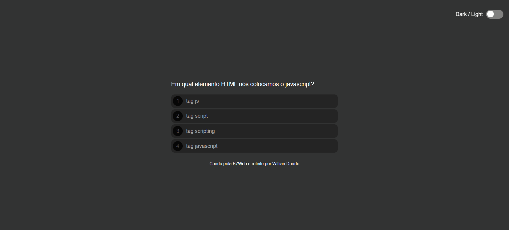

# Quiz Javascript

<h4 align='center'>QUIZ</h4>

Um quiz sobre programação com perguntas sobre javascript.  feito pela B7web e refeito por Willian Duarte

    <a href="#tecnologias">Tecnologias</a>

    <a href="https://willianduartte.github.io/Projeto-Quiz/" target="_blank">Clique aqui para Testar o app</a>

# Tecnologias
As seguintes tecnologias foram usadas:

- Javascript
- HTML5
- CSS3

Feito com <3 por [Willian Duarte](https://www.linkedin.com/in/willian-duarte-de-souza-4321a6230/)